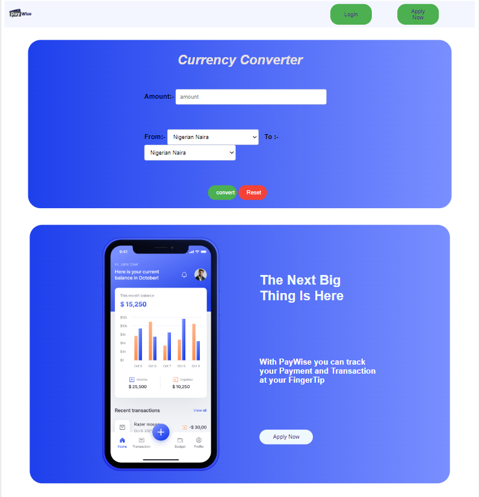
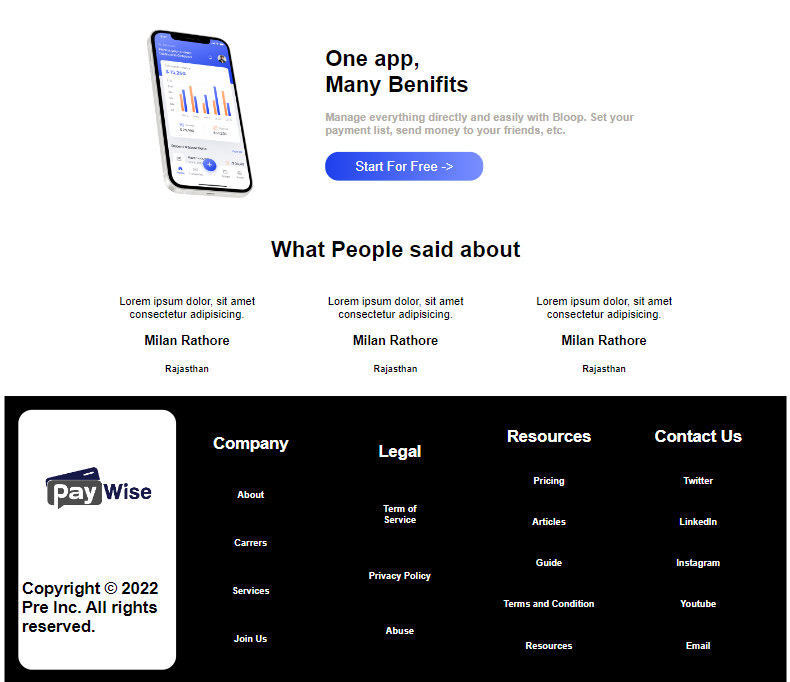
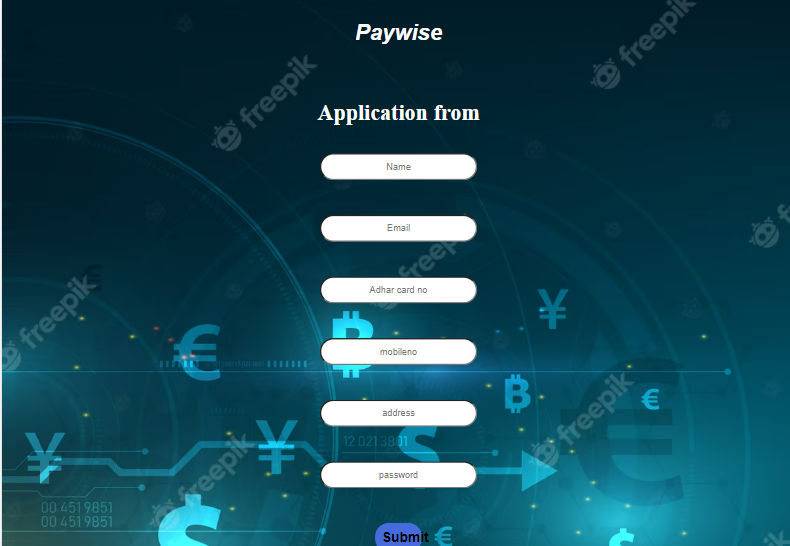

# heady-rabbits-8957

Project Mock Link => https://www.behance.net/gallery/168890935/PayWise-A-fintech-CaseStudy?tracking_source=search_projects%7Cfintech

## Project Name: PayWise

## Project Description

PayWise is a financial application that helps users quickly convert their Naira to other
currencies. Additionally, it assists students who wish to pay their school fees (JAPA©)
using their Naira account by offering a convenient payment option.

## Mock Image

 

## Features

<ul>
<li>Login</li>
<li>Apply Now</li>
<li>urrency Conversion</li>
<li>Virtual Card</li>
</ul>

## Technologies Used

<ul>
<li>HTML</li>
<li>CSS</li>
<li>JavaScript</li>
</ul>

## ScreenShot

<ul>
    <li></li>
    <li></li>
    <li></li>
    <li></li>
    <li></li>
</ul>
